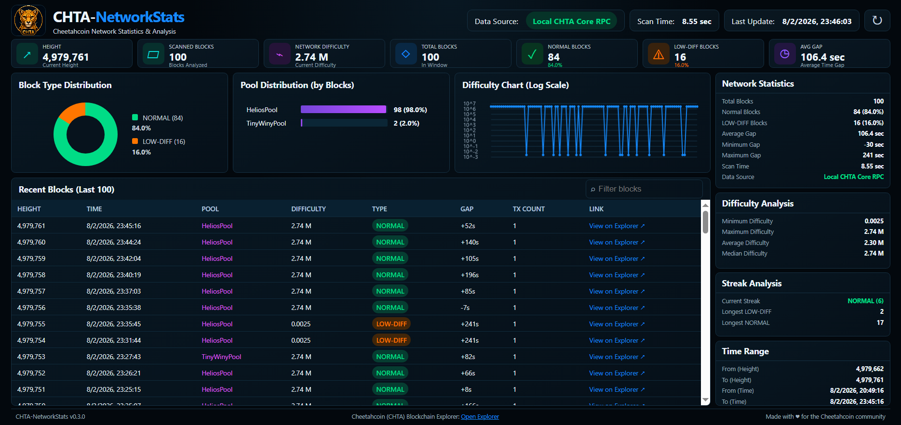

# CHTA Network Stats

A lightweight blockchain analytics tool for the Cheetahcoin network.

It can scan blocks directly from a local CHTA Core node or automatically fall back to the public API, providing both a console report and a local interactive web dashboard.




## Features


### Data sources
- Local CHTA Core RPC
- Public API
- Automatic source selection

### Console
- Network statistics
- Pool analysis
- LOW-DIFF detection
- Progress indicator
- Configurable scan depth

### Dashboard
- Local dark web dashboard
- Interactive block table
- Explorer links
- Difficulty charts
- Pool distribution charts
- Block-type charts


## Usage

```bash
CHTA-NetworkStats.exe
CHTA-NetworkStats.exe 100
CHTA-NetworkStats.exe 1000
CHTA-NetworkStats.exe web
CHTA-NetworkStats.exe web 100
```

Web mode scans the requested blocks, starts a private server at
`http://127.0.0.1:8080`, and opens the dashboard in the default browser.
Stop it with `Ctrl+C`. No blockchain data is sent anywhere by the dashboard.

## Example

```
============================================================
Network Statistics
============================================================

Total Blocks    : 5000
Normal Blocks   : 4995
LOW-DIFF Blocks : 5

Pool                Total  Normal  LOW-DIFF
------------------------------------------------
HeliosPool          4864    4859       5
TinyWinyPool          74      74       0
RT-Pool               39      39       0
Unknown               23      23       0
```

## Build

```bash
go build -o bin/CHTA-NetworkStats.exe ./cmd/networkstats
```
```bash
go build -o bin/CHTA-NetworkStats ./cmd/networkstats
```

## Roadmap


### v0.2.0
- [x] Local CHTA Core RPC
- [x] Public API
- [x] AUTO mode
- [x] Pool Analysis
- [x] Scan progress
- [x] Scan timing

### v0.3.0
- [x] Local web dashboard
- [x] Difficulty timeline
- [x] Pool and block-type analysis
- [x] Searchable block explorer table
- [ ] Streak Analysis
- [ ] Gap Analysis
- [ ] CSV export
- [ ] JSON export
- [ ] Watch mode

## License

MIT
